# Rofi Themes
Themes for Rofi: A window switcher, application launcher and dmenu replacement

# Installation
* Copy themes to your rofi directory. For example: `~/.config/rofi` or `/usr/share/rofi/themes`
* Call `rofi_theme_selector` and select your theme from the list and press `alt+a`
* Result is stored to `~/.config/rofi/config.rasi`

# Available Rofi Themes
## multicolor-darcula.rasi
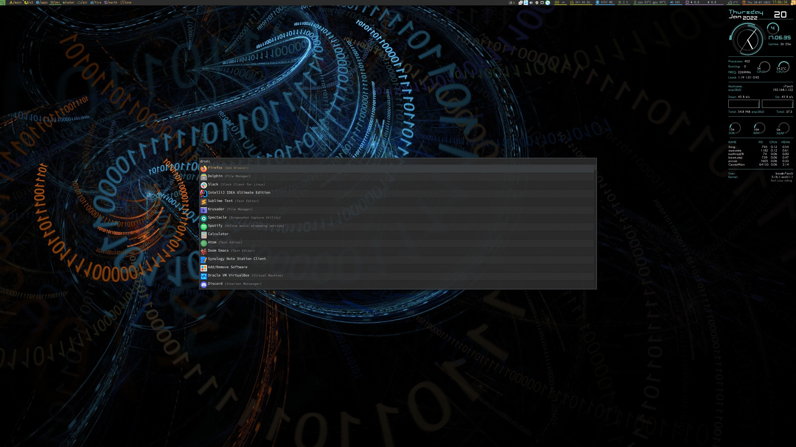
## multicolor-doom_one.rasi
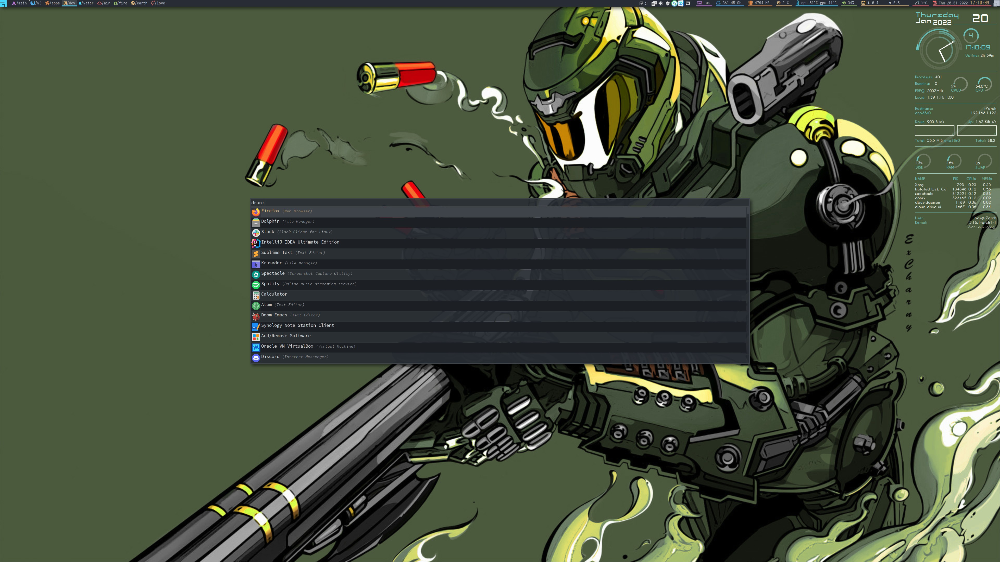
## multicolor-dracula.rasi
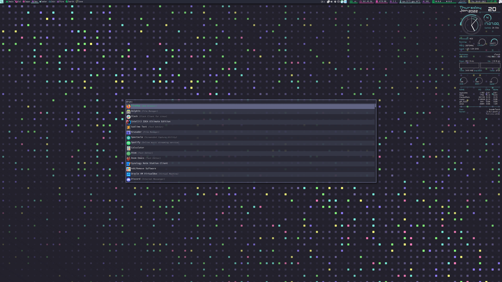
## multicolor-eighties_one_dark.rasi

## multicolor-gruvbox_dark_soft.rasi
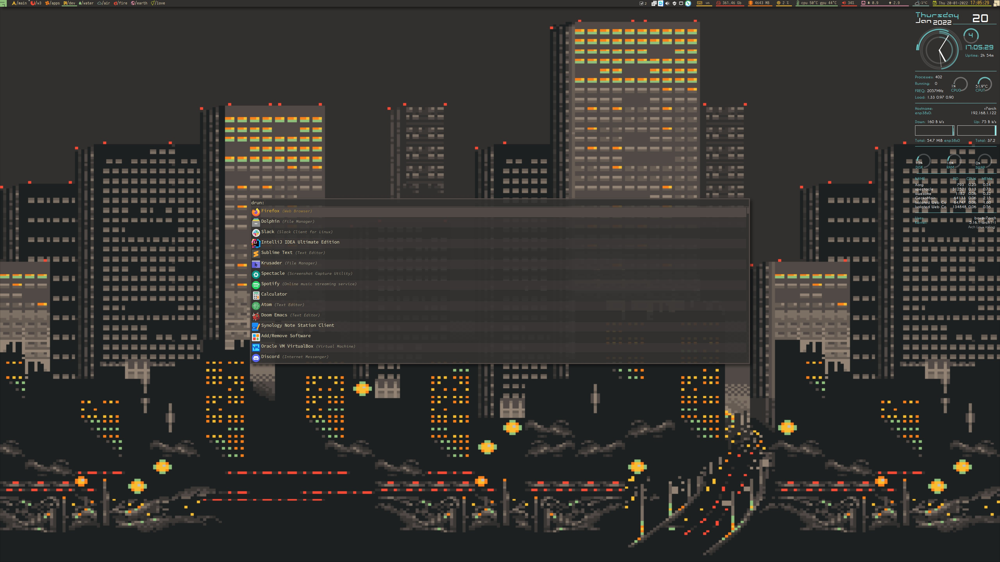
## multicolor-gruvbox_light_soft.rasi
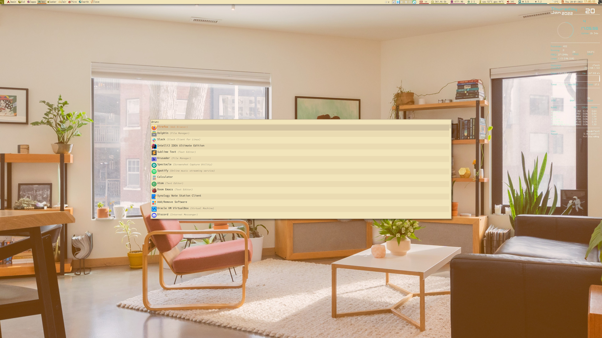
## multicolor-material.rasi
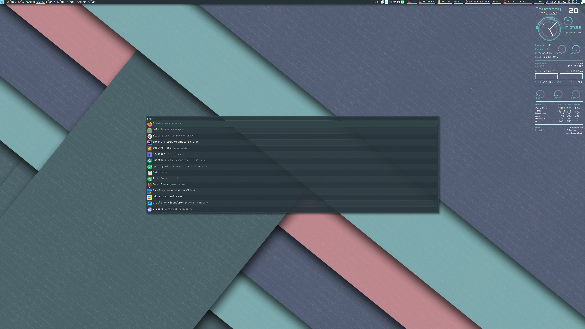
## multicolor-material_palenight.rasi
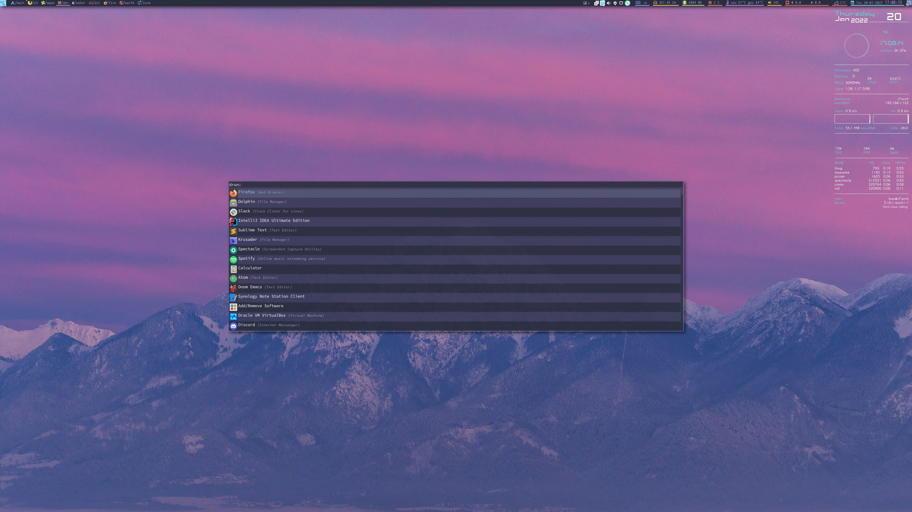
## multicolor-monokai_pro.rasi
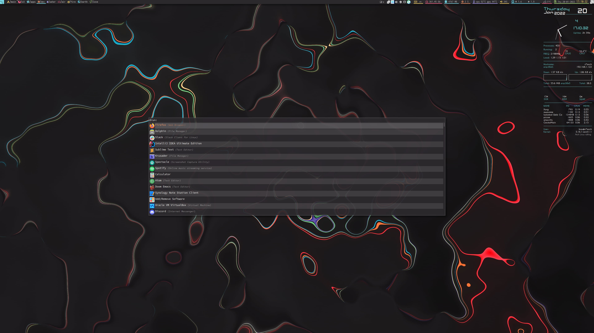
## multicolor-nord.rasi

## multicolor-oceanic_next.rasi
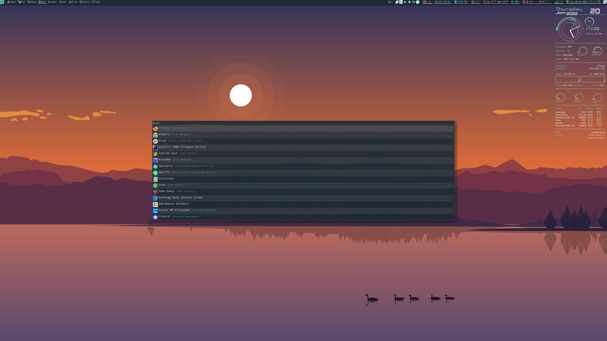
## multicolor-one_dark.rasi
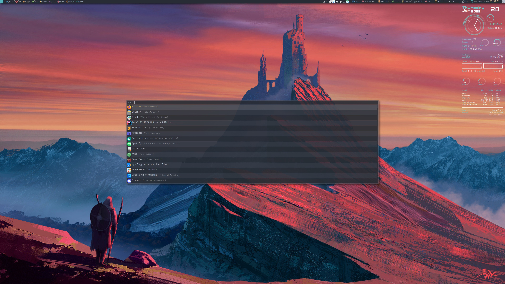
## multicolor-solarized_dark.rasi
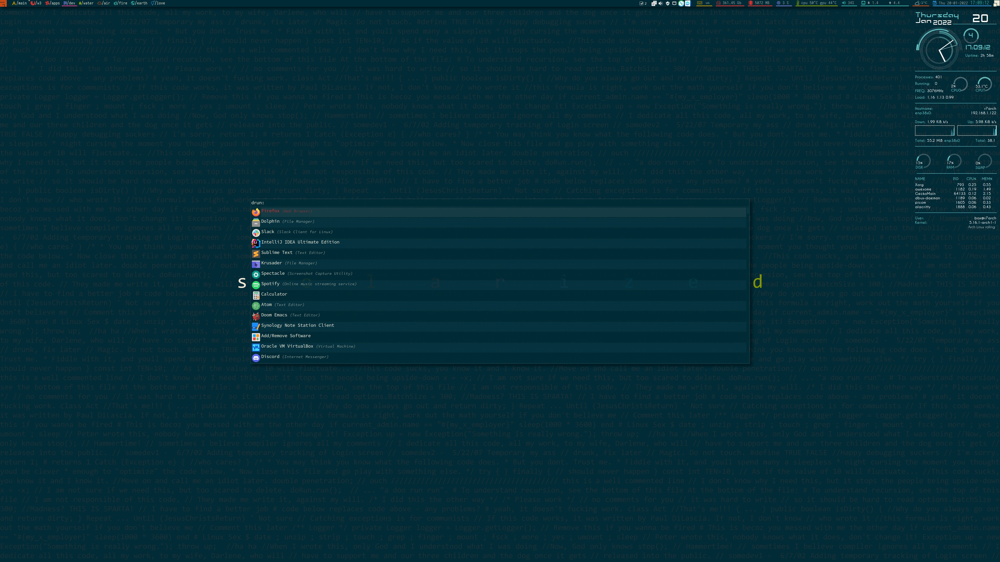
## multicolor-solarized_light.rasi

## multicolor-tomorrow_night.rasi
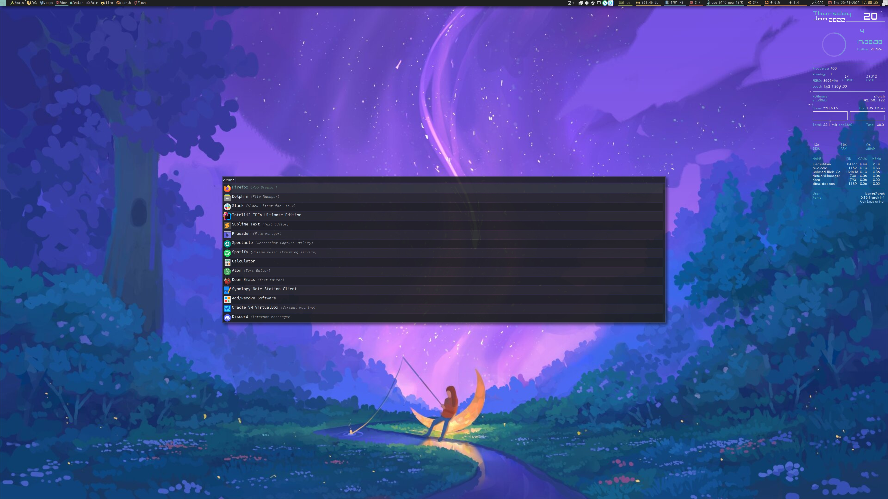
